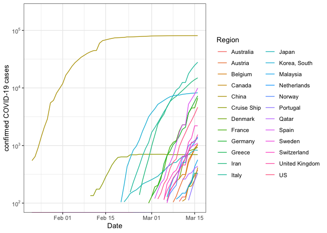
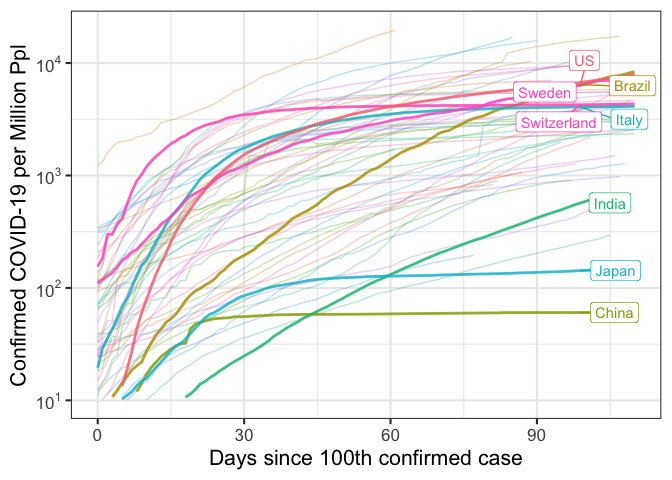
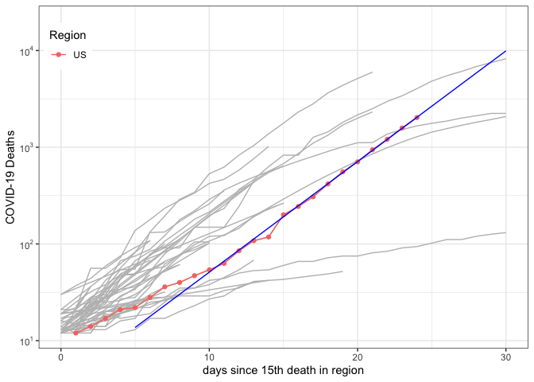
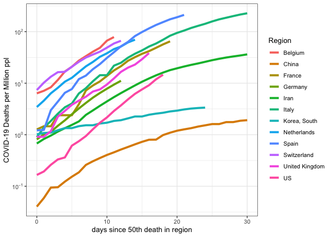

report-COVID-19
================
Thomas Gredig
3/17/2020

# COVID-19

We are comparing the growth rates in different regions. Using a 1-fit
exponential model, the confirmed cases generally fit the model well. The
doubling time is then compared.

The data is from the [CSSE COVID-19
Dataset](https://github.com/CSSEGISandData/COVID-19) after analysis of
[Coronavirus by Tomas
Pueyo](https://medium.com/@tomaspueyo/coronavirus-act-today-or-people-will-die-f4d3d9cd99ca).

## Time Series

Regions with more than 100 confirmed cases increased rapidly from a few
to many.

Only **some days later** the list of countries hugely expanded, so on
2020-03-24, we have:

<!-- -->

<!-- -->

Select a few countries with exponential growth in comparison with China:

<!-- -->

Renormalize the growth starting with the 100th confirmed case. Here is
the list of countries:

|    | Region             | Date       |
| -- | :----------------- | :--------- |
| 9  | China              | 2020-01-22 |
| 14 | Diamond Princess   | 2020-02-10 |
| 32 | Korea, South       | 2020-02-20 |
| 31 | Japan              | 2020-02-21 |
| 30 | Italy              | 2020-02-23 |
| 26 | Iran               | 2020-02-26 |
| 20 | France             | 2020-02-29 |
| 50 | Singapore          | 2020-02-29 |
| 21 | Germany            | 2020-03-01 |
| 53 | Spain              | 2020-03-02 |
| 59 | US                 | 2020-03-03 |
| 55 | Switzerland        | 2020-03-05 |
| 58 | United Kingdom     | 2020-03-05 |
| 5  | Belgium            | 2020-03-06 |
| 37 | Netherlands        | 2020-03-06 |
| 38 | Norway             | 2020-03-06 |
| 54 | Sweden             | 2020-03-06 |
| 3  | Austria            | 2020-03-08 |
| 35 | Malaysia           | 2020-03-09 |
| 2  | Australia          | 2020-03-10 |
| 4  | Bahrain            | 2020-03-10 |
| 13 | Denmark            | 2020-03-10 |
| 7  | Canada             | 2020-03-11 |
| 45 | Qatar              | 2020-03-11 |
| 23 | Iceland            | 2020-03-12 |
| 29 | Israel             | 2020-03-12 |
| 6  | Brazil             | 2020-03-13 |
| 12 | Czechia            | 2020-03-13 |
| 19 | Finland            | 2020-03-13 |
| 22 | Greece             | 2020-03-13 |
| 27 | Iraq               | 2020-03-13 |
| 44 | Portugal           | 2020-03-13 |
| 51 | Slovenia           | 2020-03-13 |
| 17 | Egypt              | 2020-03-14 |
| 18 | Estonia            | 2020-03-14 |
| 24 | India              | 2020-03-14 |
| 28 | Ireland            | 2020-03-14 |
| 42 | Philippines        | 2020-03-14 |
| 43 | Poland             | 2020-03-14 |
| 46 | Romania            | 2020-03-14 |
| 48 | Saudi Arabia       | 2020-03-14 |
| 25 | Indonesia          | 2020-03-15 |
| 33 | Lebanon            | 2020-03-15 |
| 56 | Thailand           | 2020-03-15 |
| 8  | Chile              | 2020-03-16 |
| 39 | Pakistan           | 2020-03-16 |
| 34 | Luxembourg         | 2020-03-17 |
| 41 | Peru               | 2020-03-17 |
| 47 | Russia             | 2020-03-17 |
| 16 | Ecuador            | 2020-03-18 |
| 52 | South Africa       | 2020-03-18 |
| 10 | Colombia           | 2020-03-19 |
| 11 | Croatia            | 2020-03-19 |
| 36 | Mexico             | 2020-03-19 |
| 40 | Panama             | 2020-03-19 |
| 49 | Serbia             | 2020-03-19 |
| 57 | Turkey             | 2020-03-19 |
| 1  | Argentina          | 2020-03-20 |
| 15 | Dominican Republic | 2020-03-21 |

Make a graph with the trajectories from that point onwards:

<!-- -->

Scale by population of the country:

<!-- -->

<!-- -->

Add an exponential fit:

<!-- -->

    ## 
    ## Formula: Confirmed ~ A0 * exp(DateDaysNorm/T1)
    ## 
    ## Parameters:
    ##    Estimate Std. Error t value Pr(>|t|)    
    ## T1 3.401292   0.007775   437.5   <2e-16 ***
    ## ---
    ## Signif. codes:  0 '***' 0.001 '**' 0.01 '*' 0.05 '.' 0.1 ' ' 1
    ## 
    ## Residual standard error: 1132 on 21 degrees of freedom
    ## 
    ## Number of iterations to convergence: 5 
    ## Achieved convergence tolerance: 5.515e-08

Semi-log plot:

<!-- -->

## Growth rates

Growth rates since 100th confirmed case in different countries for the
first 10 days compared with the range from 10-20 days. If the dark line
is on the right, then the doubling time is decreasing; if the dark line
is left, it means that doubling time is getting faster.

<!-- -->

## Deaths

Graphing some countries with exponentially growing death rates at the
moment:

<!-- -->

Renormalizing the start dates for `recorded deaths`, we find the dates
when the `10th death` was recorded in each country:

|    | Country          | Start |
| -- | :--------------- | ----: |
| 5  | China            |  \-23 |
| 15 | Iran             |    10 |
| 17 | Italy            |    11 |
| 19 | Korea, South     |    11 |
| 32 | US               |    19 |
| 10 | France           |    22 |
| 27 | Spain            |    22 |
| 18 | Japan            |    24 |
| 21 | Netherlands      |    28 |
| 29 | Switzerland      |    28 |
| 16 | Iraq             |    29 |
| 31 | United Kingdom   |    29 |
| 11 | Germany          |    30 |
| 23 | Philippines      |    30 |
| 2  | Belgium          |    32 |
| 14 | Indonesia        |    33 |
| 28 | Sweden           |    33 |
| 3  | Brazil           |    35 |
| 4  | Canada           |    35 |
| 6  | Denmark          |    36 |
| 9  | Egypt            |    36 |
| 12 | Greece           |    36 |
| 25 | Portugal         |    36 |
| 1  | Austria          |    37 |
| 8  | Ecuador          |    37 |
| 20 | Malaysia         |    37 |
| 30 | Turkey           |    37 |
| 13 | India            |    38 |
| 22 | Norway           |    38 |
| 7  | Diamond Princess |    39 |
| 24 | Poland           |    39 |
| 26 | Romania          |    39 |

<!-- -->

Trying to add a fit line:

<!-- -->

Renormalize by population:

<!-- -->
