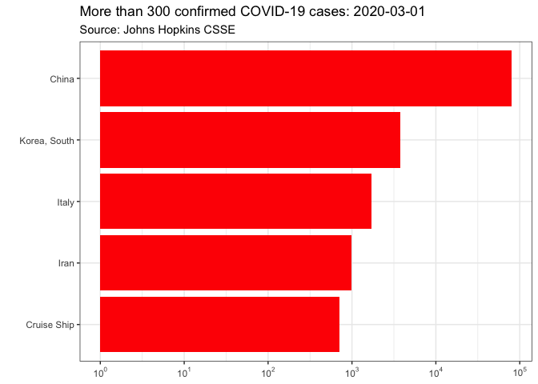
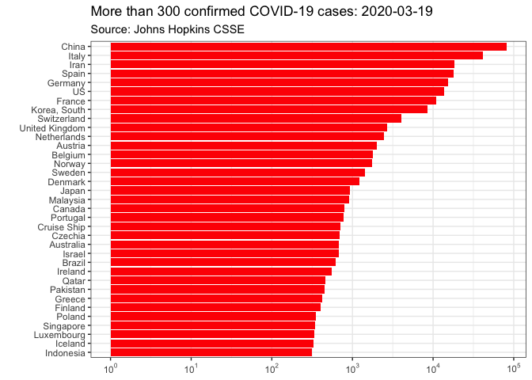
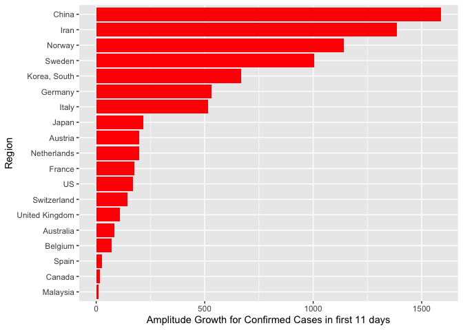

report-COVID-19
================
Thomas Gredig
3/12/2020

# COVID-19

We determine the order of countries it spread using the exponential
growth model and determine that it started in China, then spread to
Iran, South Korea, Italy, U.S., France, and then Spain based on
confirmed deaths.

Japan and South Korea have a much slower growth in the death rate (see
graph at the bottom). China, Italy, and U.S. appear to have common
trajectories.

The data is from the [CSSE COVID-19
Dataset](https://github.com/CSSEGISandData/COVID-19) after analysis of
[Coronavirus by Tomas
Pueyo](https://medium.com/@tomaspueyo/coronavirus-act-today-or-people-will-die-f4d3d9cd99ca).

## Time Series

Regions with more than 100 confirmed cases increased rapidly from Mar 1
to Mar 11:

<!-- -->

Only **some days later** the list of countries hugely expanded, so on
2020-03-16, we have:

<!-- -->

<!-- -->

Select a few countries with exponential growth in comparison with China:

<!-- -->

Renormalize the growth starting with the 100th confirmed case. Here is
the list of countries:

|    | Region         | Date       |
| -- | :------------- | :--------- |
| 5  | China          | 2020-01-22 |
| 6  | Cruise Ship    | 2020-02-10 |
| 14 | Korea, South   | 2020-02-20 |
| 13 | Japan          | 2020-02-21 |
| 12 | Italy          | 2020-02-23 |
| 11 | Iran           | 2020-02-26 |
| 8  | France         | 2020-02-29 |
| 9  | Germany        | 2020-03-01 |
| 20 | Spain          | 2020-03-02 |
| 24 | US             | 2020-03-03 |
| 22 | Switzerland    | 2020-03-05 |
| 23 | United Kingdom | 2020-03-05 |
| 3  | Belgium        | 2020-03-06 |
| 16 | Netherlands    | 2020-03-06 |
| 17 | Norway         | 2020-03-06 |
| 21 | Sweden         | 2020-03-06 |
| 2  | Austria        | 2020-03-08 |
| 15 | Malaysia       | 2020-03-09 |
| 1  | Australia      | 2020-03-10 |
| 7  | Denmark        | 2020-03-10 |
| 4  | Canada         | 2020-03-11 |
| 19 | Qatar          | 2020-03-11 |
| 10 | Greece         | 2020-03-13 |
| 18 | Portugal       | 2020-03-13 |

Make a graph with the trajectories from that point onwards:

<!-- -->

Add an exponential fit:

<!-- -->

    ## 
    ## Formula: Confirmed ~ A + B * exp(DateDaysNorm/T1)
    ## 
    ## Parameters:
    ##    Estimate Std. Error t value Pr(>|t|)    
    ## A  -93.4514    43.0040  -2.173   0.0525 .  
    ## B  178.0947    18.1400   9.818 8.88e-07 ***
    ## T1   3.9717     0.1202  33.031 2.34e-12 ***
    ## ---
    ## Signif. codes:  0 '***' 0.001 '**' 0.01 '*' 0.05 '.' 0.1 ' ' 1
    ## 
    ## Residual standard error: 53.66 on 11 degrees of freedom
    ## 
    ## Number of iterations to convergence: 5 
    ## Achieved convergence tolerance: 1.003e-06

## Growth rates

Growth rates since 100th confirmed case in different countries for first
10 days.

<!-- --><!-- -->

<!-- -->

## Deaths

Graphing some countries with exponentially growing death rates at the
moment:

<!-- -->

Renormalizing the start dates for `recorded deaths`, we find the dates
when the `5th death` was recorded in each country:

|    | Country        | Start |
| -- | :------------- | ----: |
| 1  | China          |  \-23 |
| 5  | Iran           |     9 |
| 8  | Korea, South   |     9 |
| 6  | Italy          |    10 |
| 2  | Cruise Ship    |    14 |
| 7  | Japan          |    16 |
| 14 | US             |    17 |
| 3  | France         |    20 |
| 10 | Spain          |    22 |
| 13 | United Kingdom |    25 |
| 4  | Germany        |    28 |
| 9  | Netherlands    |    28 |
| 12 | Switzerland    |    28 |
| 11 | Sweden         |    31 |

Renormalizing the start dates for `recorded deaths`, we find the dates
when the `15th death` was recorded in each country:

|    | Country        | Start |
| -- | :------------- | ----: |
| 1  | China          |  \-23 |
| 4  | Iran           |    11 |
| 5  | Italy          |    13 |
| 7  | Korea, South   |    15 |
| 11 | US             |    22 |
| 2  | France         |    23 |
| 9  | Spain          |    23 |
| 6  | Japan          |    27 |
| 10 | United Kingdom |    29 |
| 8  | Netherlands    |    30 |
| 3  | Germany        |    31 |

<!-- -->
