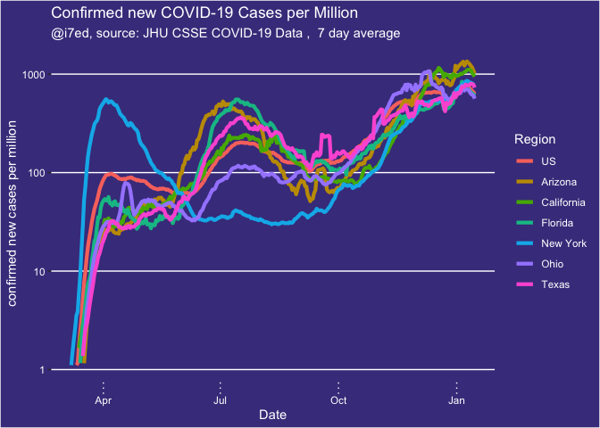
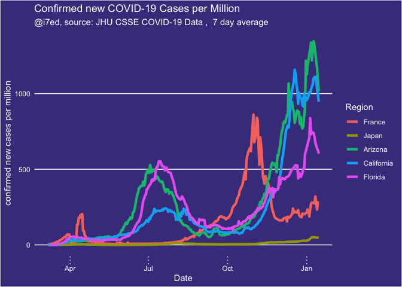

report-COVID-19
================
Thomas Gredig
5/8/2020

# COVID-19

We are comparing the growth rates in different regions. Using a 1-fit
exponential model, the confirmed cases generally fit the model well. The
doubling time is then compared.

The data is from the [CSSE COVID-19
Dataset](https://github.com/CSSEGISandData/COVID-19) after analysis of
[Coronavirus by Tomas
Pueyo](https://medium.com/@tomaspueyo/coronavirus-act-today-or-people-will-die-f4d3d9cd99ca).

Projections based on [SIR
models](https://www.maa.org/press/periodicals/loci/joma/the-sir-model-for-spread-of-disease-the-differential-equation-model)
from [HealthData](https://covid19.healthdata.org/projections).

## Time Series

Regions with more than 5,000 confirmed cases increased rapidly from a
few to many.

On 2020-05-12, we have:

<!-- -->

<!-- -->

Select a few countries with exponential growth in comparison with China:

<!-- -->

Renormalize the growth starting with the 1000th confirmed case. Here is
the list of countries:

Make a graph with the trajectories from that point onwards:

<!-- -->

Scale by population of the country:

<!-- -->

<!-- -->

Add an exponential fit:

<!-- -->

    ## 
    ## Formula: Confirmed ~ A * exp(DateDaysNorm/T1)
    ## 
    ## Parameters:
    ##     Estimate Std. Error t value Pr(>|t|)    
    ## A  3.588e+05  1.058e+04   33.91 1.35e-15 ***
    ## T1 4.572e+01  1.116e+00   40.98  < 2e-16 ***
    ## ---
    ## Signif. codes:  0 '***' 0.001 '**' 0.01 '*' 0.05 '.' 0.1 ' ' 1
    ## 
    ## Residual standard error: 12570 on 15 degrees of freedom
    ## 
    ## Number of iterations to convergence: 26 
    ## Achieved convergence tolerance: 1.617e-07

Semi-log plot:

<!-- -->

## Growth rates

Growth rates since 100th confirmed case in different countries for the
first 15 days compared with the range from 15-30 days. If the dark line
is on the right, then the doubling time is decreasing; if the dark line
is left, it means that doubling time is getting faster.

<!-- -->

## Deaths

Graphing some countries with exponentially growing death rates at the
moment:

<!-- -->

Renormalizing the start dates for `recorded deaths`, we find the dates
when the `100th death` was recorded in each country:

<!-- -->

Trying to add a fit line:

<!-- -->

Renormalize by population:

<!-- -->

<!-- -->
