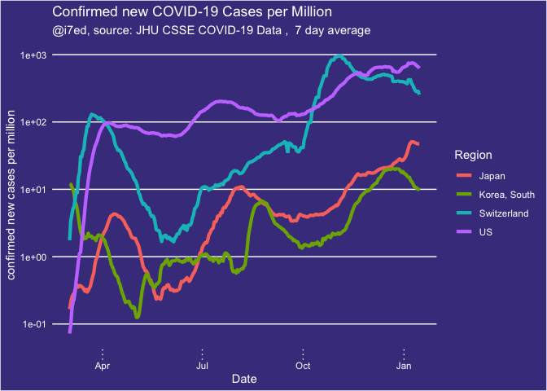
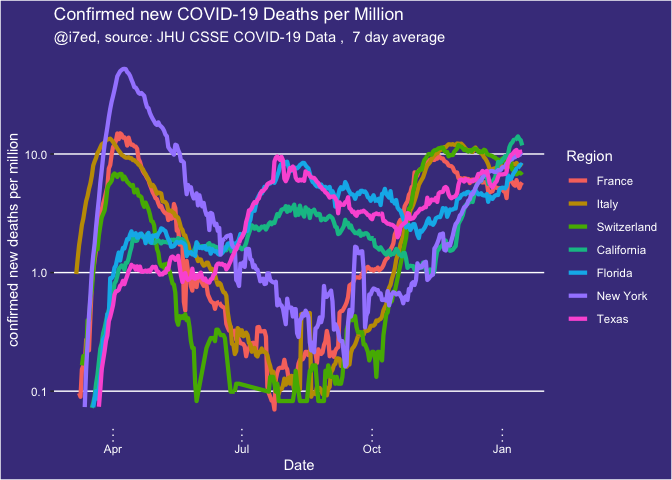
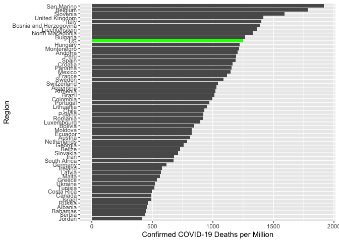

report-COVID-19
================
Thomas Gredig
7/12/2020

  - [COVID-19](#covid-19)
  - [Confirmed COVID-19 Cases](#confirmed-covid-19-cases)
      - [World](#world)
      - [United States](#united-states)
  - [COVID-19 DEATHS](#covid-19-deaths)
      - [World](#world-1)
      - [U.S.](#u.s.)
      - [Death Rates by Country and U.S.
        States](#death-rates-by-country-and-u.s.-states)

# COVID-19

We are comparing the growth rates in different regions.

The data is from the [CSSE COVID-19
Dataset](https://github.com/CSSEGISandData/COVID-19).

Projections based on [SIR
models](https://www.maa.org/press/periodicals/loci/joma/the-sir-model-for-spread-of-disease-the-differential-equation-model)
from [HealthData](https://covid19.healthdata.org/projections).

# Confirmed COVID-19 Cases

## World

Confirmed cases over time for different regions:

<!-- -->

Some of the larger countries in the world:

<!-- -->

Japan, Switzerland and U.S. on log-scale:

<!-- -->

## United States

Some selected regions within the U.S.

<!-- -->

<!-- -->

# COVID-19 DEATHS

## World

Statistics of some of the larger countries including Brazil:

<!-- -->

## U.S.

Statistics of selected U.S. states

<!-- -->

The 3 most populous states in the U.S.

<!-- -->

<!-- -->

## Death Rates by Country and U.S. States

As computed of 2020-11-03:

<!-- -->

<!-- -->

All countries:

<!-- -->
