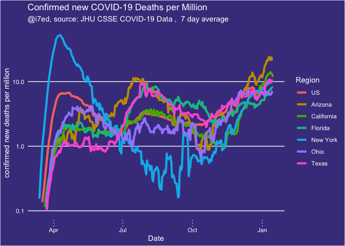

report-COVID-19
================
Thomas Gredig
3/17/2020

# COVID-19

We are comparing the growth rates in different regions. Using a 1-fit
exponential model, the confirmed cases generally fit the model well. The
doubling time is then compared.

The data is from the [CSSE COVID-19
Dataset](https://github.com/CSSEGISandData/COVID-19) after analysis of
[Coronavirus by Tomas
Pueyo](https://medium.com/@tomaspueyo/coronavirus-act-today-or-people-will-die-f4d3d9cd99ca).

## Time Series

Regions with more than 100 confirmed cases increased rapidly from a few
to many.

Only **some days later** the list of countries hugely expanded, so on
2020-03-27, we have:

<!-- -->

<!-- -->

Select a few countries with exponential growth in comparison with China:

<!-- -->

Renormalize the growth starting with the 100th confirmed case. Here is
the list of countries:

|    | Region               | Date       |
| -- | :------------------- | :--------- |
| 11 | China                | 2020-01-22 |
| 16 | Diamond Princess     | 2020-02-10 |
| 34 | Korea, South         | 2020-02-20 |
| 33 | Japan                | 2020-02-21 |
| 32 | Italy                | 2020-02-23 |
| 28 | Iran                 | 2020-02-26 |
| 22 | France               | 2020-02-29 |
| 55 | Singapore            | 2020-02-29 |
| 23 | Germany              | 2020-03-01 |
| 58 | Spain                | 2020-03-02 |
| 66 | US                   | 2020-03-03 |
| 60 | Switzerland          | 2020-03-05 |
| 65 | United Kingdom       | 2020-03-05 |
| 7  | Belgium              | 2020-03-06 |
| 41 | Netherlands          | 2020-03-06 |
| 43 | Norway               | 2020-03-06 |
| 59 | Sweden               | 2020-03-06 |
| 5  | Austria              | 2020-03-08 |
| 38 | Malaysia             | 2020-03-09 |
| 4  | Australia            | 2020-03-10 |
| 6  | Bahrain              | 2020-03-10 |
| 15 | Denmark              | 2020-03-10 |
| 9  | Canada               | 2020-03-11 |
| 50 | Qatar                | 2020-03-11 |
| 25 | Iceland              | 2020-03-12 |
| 31 | Israel               | 2020-03-12 |
| 8  | Brazil               | 2020-03-13 |
| 14 | Czechia              | 2020-03-13 |
| 21 | Finland              | 2020-03-13 |
| 24 | Greece               | 2020-03-13 |
| 29 | Iraq                 | 2020-03-13 |
| 49 | Portugal             | 2020-03-13 |
| 56 | Slovenia             | 2020-03-13 |
| 19 | Egypt                | 2020-03-14 |
| 20 | Estonia              | 2020-03-14 |
| 26 | India                | 2020-03-14 |
| 30 | Ireland              | 2020-03-14 |
| 47 | Philippines          | 2020-03-14 |
| 48 | Poland               | 2020-03-14 |
| 51 | Romania              | 2020-03-14 |
| 53 | Saudi Arabia         | 2020-03-14 |
| 27 | Indonesia            | 2020-03-15 |
| 35 | Lebanon              | 2020-03-15 |
| 61 | Thailand             | 2020-03-15 |
| 10 | Chile                | 2020-03-16 |
| 44 | Pakistan             | 2020-03-16 |
| 37 | Luxembourg           | 2020-03-17 |
| 46 | Peru                 | 2020-03-17 |
| 52 | Russia               | 2020-03-17 |
| 18 | Ecuador              | 2020-03-18 |
| 57 | South Africa         | 2020-03-18 |
| 64 | United Arab Emirates | 2020-03-18 |
| 3  | Armenia              | 2020-03-19 |
| 12 | Colombia             | 2020-03-19 |
| 13 | Croatia              | 2020-03-19 |
| 39 | Mexico               | 2020-03-19 |
| 45 | Panama               | 2020-03-19 |
| 54 | Serbia               | 2020-03-19 |
| 62 | Turkey               | 2020-03-19 |
| 2  | Argentina            | 2020-03-20 |
| 1  | Algeria              | 2020-03-21 |
| 17 | Dominican Republic   | 2020-03-21 |
| 36 | Lithuania            | 2020-03-22 |
| 40 | Morocco              | 2020-03-22 |
| 42 | New Zealand          | 2020-03-22 |
| 63 | Ukraine              | 2020-03-25 |

Make a graph with the trajectories from that point onwards:

<!-- -->

Scale by population of the country:

<!-- -->

<!-- -->

Add an exponential fit:

<!-- -->

    ## 
    ## Formula: Confirmed ~ A0 * exp(DateDaysNorm/T1)
    ## 
    ## Parameters:
    ##    Estimate Std. Error t value Pr(>|t|)    
    ## T1  3.50608    0.01147   305.7   <2e-16 ***
    ## ---
    ## Signif. codes:  0 '***' 0.001 '**' 0.01 '*' 0.05 '.' 0.1 ' ' 1
    ## 
    ## Residual standard error: 3571 on 24 degrees of freedom
    ## 
    ## Number of iterations to convergence: 5 
    ## Achieved convergence tolerance: 3.865e-07

Semi-log plot:

<!-- -->

## Growth rates

Growth rates since 100th confirmed case in different countries for the
first 10 days compared with the range from 10-25 days. If the dark line
is on the right, then the doubling time is decreasing; if the dark line
is left, it means that doubling time is getting faster.

<!-- -->

## Deaths

Graphing some countries with exponentially growing death rates at the
moment:

<!-- -->

Renormalizing the start dates for `recorded deaths`, we find the dates
when the `10th death` was recorded in each country:

<!-- -->

Trying to add a fit line:

<!-- -->

Renormalize by population:

<!-- -->
