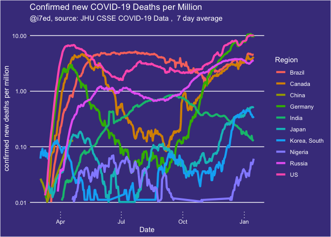

report-COVID-19
================
Thomas Gredig
3/17/2020

# COVID-19

We are comparing the growth rates in different regions. Using a 1-fit
exponential model, the confirmed cases generally fit the model well. The
doubling time is then compared.

The data is from the [CSSE COVID-19
Dataset](https://github.com/CSSEGISandData/COVID-19) after analysis of
[Coronavirus by Tomas
Pueyo](https://medium.com/@tomaspueyo/coronavirus-act-today-or-people-will-die-f4d3d9cd99ca).

## Time Series

Regions with more than 100 confirmed cases increased rapidly from Mar 1
to Mar 11:

<!-- -->

Only **some days later** the list of countries hugely expanded, so on
2020-03-17, we have:

<!-- -->

<!-- -->

Select a few countries with exponential growth in comparison with China:

<!-- -->

Renormalize the growth starting with the 100th confirmed case. Here is
the list of countries:

|    | Region         | Date       |
| -- | :------------- | :--------- |
| 6  | China          | 2020-01-22 |
| 7  | Cruise Ship    | 2020-02-10 |
| 18 | Korea, South   | 2020-02-20 |
| 17 | Japan          | 2020-02-21 |
| 16 | Italy          | 2020-02-23 |
| 14 | Iran           | 2020-02-26 |
| 11 | France         | 2020-02-29 |
| 12 | Germany        | 2020-03-01 |
| 24 | Spain          | 2020-03-02 |
| 28 | US             | 2020-03-03 |
| 26 | Switzerland    | 2020-03-05 |
| 27 | United Kingdom | 2020-03-05 |
| 3  | Belgium        | 2020-03-06 |
| 20 | Netherlands    | 2020-03-06 |
| 21 | Norway         | 2020-03-06 |
| 25 | Sweden         | 2020-03-06 |
| 2  | Austria        | 2020-03-08 |
| 19 | Malaysia       | 2020-03-09 |
| 1  | Australia      | 2020-03-10 |
| 9  | Denmark        | 2020-03-10 |
| 5  | Canada         | 2020-03-11 |
| 15 | Israel         | 2020-03-11 |
| 23 | Qatar          | 2020-03-11 |
| 4  | Brazil         | 2020-03-13 |
| 8  | Czechia        | 2020-03-13 |
| 10 | Finland        | 2020-03-13 |
| 13 | Greece         | 2020-03-13 |
| 22 | Portugal       | 2020-03-13 |

Make a graph with the trajectories from that point onwards:

<!-- -->

Add an exponential fit:

<!-- -->

    ## 
    ## Formula: Confirmed ~ A0 * exp(DateDaysNorm/T1)
    ## 
    ## Parameters:
    ##    Estimate Std. Error t value Pr(>|t|)    
    ## T1 3.512420   0.008733   402.2   <2e-16 ***
    ## ---
    ## Signif. codes:  0 '***' 0.001 '**' 0.01 '*' 0.05 '.' 0.1 ' ' 1
    ## 
    ## Residual standard error: 87.45 on 14 degrees of freedom
    ## 
    ## Number of iterations to convergence: 4 
    ## Achieved convergence tolerance: 9.925e-06

Semi-log plot:

<!-- -->

## Growth rates

Growth rates since 100th confirmed case in different countries for first
10 days.

<!-- -->

## Deaths

Graphing some countries with exponentially growing death rates at the
moment:

<!-- -->

Renormalizing the start dates for `recorded deaths`, we find the dates
when the `5th death` was recorded in each country:

|    | Country        | Start |
| -- | :------------- | ----: |
| 2  | China          |  \-23 |
| 6  | Iran           |     9 |
| 9  | Korea, South   |     9 |
| 7  | Italy          |    10 |
| 3  | Cruise Ship    |    14 |
| 8  | Japan          |    16 |
| 15 | US             |    17 |
| 4  | France         |    20 |
| 11 | Spain          |    22 |
| 14 | United Kingdom |    25 |
| 5  | Germany        |    28 |
| 10 | Netherlands    |    28 |
| 13 | Switzerland    |    28 |
| 12 | Sweden         |    31 |
| 1  | Belgium        |    32 |

Renormalizing the start dates for `recorded deaths`, we find the dates
when the `15th death` was recorded in each country:

|    | Country        | Start |
| -- | :------------- | ----: |
| 1  | China          |  \-23 |
| 4  | Iran           |    11 |
| 5  | Italy          |    13 |
| 7  | Korea, South   |    15 |
| 12 | US             |    22 |
| 2  | France         |    23 |
| 9  | Spain          |    23 |
| 6  | Japan          |    27 |
| 11 | United Kingdom |    29 |
| 8  | Netherlands    |    30 |
| 3  | Germany        |    31 |
| 10 | Switzerland    |    32 |

<!-- -->
