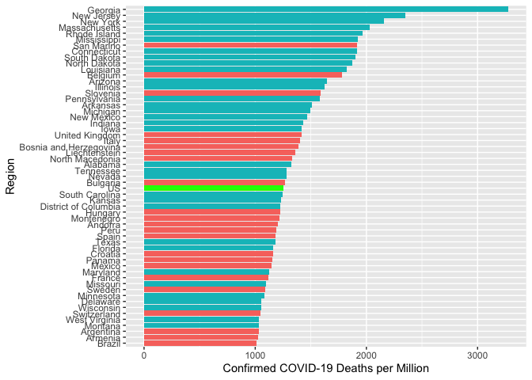

report-COVID-19
================
Thomas Gredig
3/17/2020

# COVID-19

We are comparing the growth rates in different regions. Using a 1-fit
exponential model, the confirmed cases generally fit the model well. The
doubling time is then compared.

The data is from the [CSSE COVID-19
Dataset](https://github.com/CSSEGISandData/COVID-19) after analysis of
[Coronavirus by Tomas
Pueyo](https://medium.com/@tomaspueyo/coronavirus-act-today-or-people-will-die-f4d3d9cd99ca).

## Time Series

Regions with more than 100 confirmed cases increased rapidly from Mar 1
to Mar 11:

<!-- -->

Only **some days later** the list of countries hugely expanded, so on
2020-03-20, we have:

<!-- -->

<!-- -->

Select a few countries with exponential growth in comparison with China:

<!-- -->

Renormalize the growth starting with the 100th confirmed case. Here is
the list of countries:

|    | Region         | Date       |
| -- | :------------- | :--------- |
| 7  | China          | 2020-01-22 |
| 8  | Cruise Ship    | 2020-02-10 |
| 23 | Korea, South   | 2020-02-20 |
| 22 | Japan          | 2020-02-21 |
| 21 | Italy          | 2020-02-23 |
| 18 | Iran           | 2020-02-26 |
| 13 | France         | 2020-02-29 |
| 34 | Singapore      | 2020-02-29 |
| 14 | Germany        | 2020-03-01 |
| 36 | Spain          | 2020-03-02 |
| 42 | US             | 2020-03-03 |
| 38 | Switzerland    | 2020-03-05 |
| 41 | United Kingdom | 2020-03-05 |
| 3  | Belgium        | 2020-03-06 |
| 26 | Netherlands    | 2020-03-06 |
| 27 | Norway         | 2020-03-06 |
| 37 | Sweden         | 2020-03-06 |
| 2  | Austria        | 2020-03-08 |
| 25 | Malaysia       | 2020-03-09 |
| 1  | Australia      | 2020-03-10 |
| 10 | Denmark        | 2020-03-10 |
| 5  | Canada         | 2020-03-11 |
| 20 | Israel         | 2020-03-11 |
| 31 | Qatar          | 2020-03-11 |
| 16 | Iceland        | 2020-03-12 |
| 4  | Brazil         | 2020-03-13 |
| 9  | Czechia        | 2020-03-13 |
| 12 | Finland        | 2020-03-13 |
| 15 | Greece         | 2020-03-13 |
| 30 | Portugal       | 2020-03-13 |
| 35 | Slovenia       | 2020-03-13 |
| 19 | Ireland        | 2020-03-14 |
| 29 | Poland         | 2020-03-14 |
| 32 | Romania        | 2020-03-14 |
| 33 | Saudi Arabia   | 2020-03-14 |
| 17 | Indonesia      | 2020-03-15 |
| 39 | Thailand       | 2020-03-15 |
| 6  | Chile          | 2020-03-16 |
| 28 | Pakistan       | 2020-03-16 |
| 24 | Luxembourg     | 2020-03-17 |
| 11 | Ecuador        | 2020-03-18 |
| 40 | Turkey         | 2020-03-19 |

Make a graph with the trajectories from that point onwards:

<!-- -->

Add an exponential fit:

<!-- -->

    ## 
    ## Formula: Confirmed ~ A0 * exp(DateDaysNorm/T1)
    ## 
    ## Parameters:
    ##    Estimate Std. Error t value Pr(>|t|)    
    ## T1  3.39021    0.01893   179.1   <2e-16 ***
    ## ---
    ## Signif. codes:  0 '***' 0.001 '**' 0.01 '*' 0.05 '.' 0.1 ' ' 1
    ## 
    ## Residual standard error: 694.4 on 17 degrees of freedom
    ## 
    ## Number of iterations to convergence: 5 
    ## Achieved convergence tolerance: 2.908e-07

Semi-log plot:

<!-- -->

## Growth rates

Growth rates since 100th confirmed case in different countries for first
15 days.

<!-- -->

## Deaths

Graphing some countries with exponentially growing death rates at the
moment:

<!-- -->

Renormalizing the start dates for `recorded deaths`, we find the dates
when the `5th death` was recorded in each country:

Renormalizing the start dates for `recorded deaths`, we find the dates
when the `10th death` was recorded in each country:

|    | Country        | Start |
| -- | :------------- | ----: |
| 4  | China          |  \-23 |
| 8  | Iran           |    10 |
| 9  | Italy          |    11 |
| 11 | Korea, South   |    11 |
| 17 | US             |    19 |
| 5  | France         |    22 |
| 13 | Spain          |    22 |
| 10 | Japan          |    24 |
| 12 | Netherlands    |    28 |
| 15 | Switzerland    |    28 |
| 16 | United Kingdom |    29 |
| 6  | Germany        |    30 |
| 1  | Belgium        |    32 |
| 7  | Indonesia      |    33 |
| 14 | Sweden         |    33 |
| 2  | Brazil         |    35 |
| 3  | Canada         |    35 |

<!-- -->
