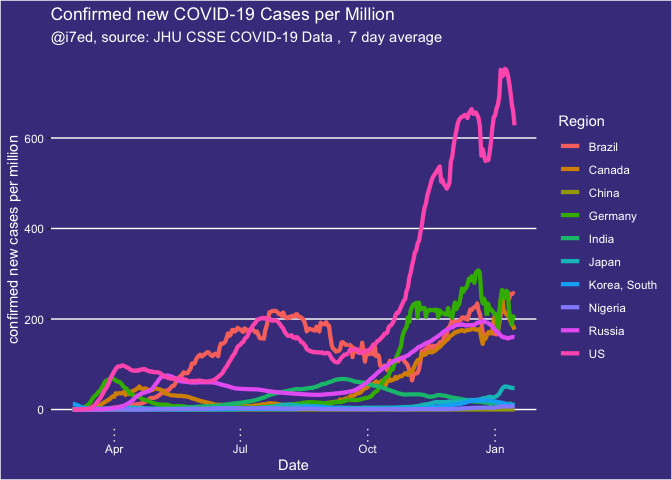
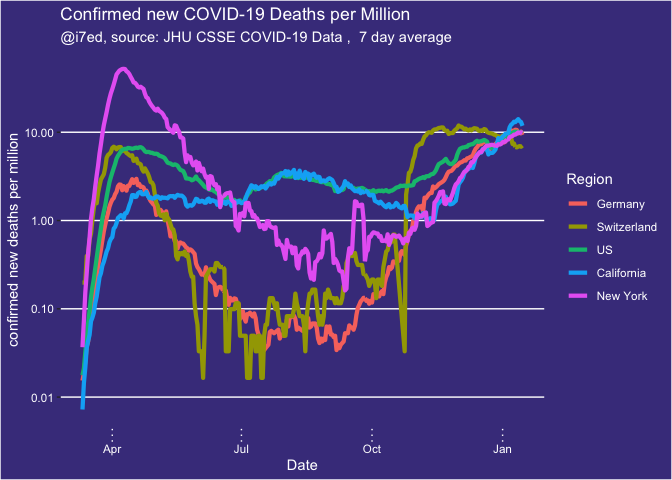

report-COVID-19
================
Thomas Gredig
3/17/2020

# COVID-19

We are comparing the growth rates in different regions. Using a 1-fit
exponential model, the confirmed cases generally fit the model well. The
doubling time is then compared.

The data is from the [CSSE COVID-19
Dataset](https://github.com/CSSEGISandData/COVID-19) after analysis of
[Coronavirus by Tomas
Pueyo](https://medium.com/@tomaspueyo/coronavirus-act-today-or-people-will-die-f4d3d9cd99ca).

## Time Series

Regions with more than 100 confirmed cases increased rapidly from a few
to many.

Only **some days later** the list of countries hugely expanded, so on
2020-03-22, we have:

<!-- -->

<!-- -->

Select a few countries with exponential growth in comparison with China:

<!-- -->

Renormalize the growth starting with the 100th confirmed case. Here is
the list of countries:

|    | Region         | Date       |
| -- | :------------- | :--------- |
| 8  | China          | 2020-01-22 |
| 9  | Cruise Ship    | 2020-02-10 |
| 27 | Korea, South   | 2020-02-20 |
| 26 | Japan          | 2020-02-21 |
| 25 | Italy          | 2020-02-23 |
| 22 | Iran           | 2020-02-26 |
| 16 | France         | 2020-02-29 |
| 41 | Singapore      | 2020-02-29 |
| 17 | Germany        | 2020-03-01 |
| 43 | Spain          | 2020-03-02 |
| 49 | US             | 2020-03-03 |
| 45 | Switzerland    | 2020-03-05 |
| 48 | United Kingdom | 2020-03-05 |
| 4  | Belgium        | 2020-03-06 |
| 30 | Netherlands    | 2020-03-06 |
| 31 | Norway         | 2020-03-06 |
| 44 | Sweden         | 2020-03-06 |
| 2  | Austria        | 2020-03-08 |
| 29 | Malaysia       | 2020-03-09 |
| 1  | Australia      | 2020-03-10 |
| 3  | Bahrain        | 2020-03-10 |
| 11 | Denmark        | 2020-03-10 |
| 6  | Canada         | 2020-03-11 |
| 24 | Israel         | 2020-03-11 |
| 37 | Qatar          | 2020-03-11 |
| 19 | Iceland        | 2020-03-12 |
| 5  | Brazil         | 2020-03-13 |
| 10 | Czechia        | 2020-03-13 |
| 15 | Finland        | 2020-03-13 |
| 18 | Greece         | 2020-03-13 |
| 36 | Portugal       | 2020-03-13 |
| 42 | Slovenia       | 2020-03-13 |
| 13 | Egypt          | 2020-03-14 |
| 14 | Estonia        | 2020-03-14 |
| 20 | India          | 2020-03-14 |
| 23 | Ireland        | 2020-03-14 |
| 34 | Philippines    | 2020-03-14 |
| 35 | Poland         | 2020-03-14 |
| 38 | Romania        | 2020-03-14 |
| 40 | Saudi Arabia   | 2020-03-14 |
| 21 | Indonesia      | 2020-03-15 |
| 46 | Thailand       | 2020-03-15 |
| 7  | Chile          | 2020-03-16 |
| 32 | Pakistan       | 2020-03-16 |
| 28 | Luxembourg     | 2020-03-17 |
| 33 | Peru           | 2020-03-17 |
| 39 | Russia         | 2020-03-17 |
| 12 | Ecuador        | 2020-03-18 |
| 47 | Turkey         | 2020-03-19 |

Make a graph with the trajectories from that point onwards:

<!-- -->

Scale by population of the country:

<!-- -->

<!-- -->

Add an exponential fit:

<!-- -->

    ## 
    ## Formula: Confirmed ~ A0 * exp(DateDaysNorm/T1)
    ## 
    ## Parameters:
    ##    Estimate Std. Error t value Pr(>|t|)    
    ## T1 3.368078   0.009041   372.5   <2e-16 ***
    ## ---
    ## Signif. codes:  0 '***' 0.001 '**' 0.01 '*' 0.05 '.' 0.1 ' ' 1
    ## 
    ## Residual standard error: 706.7 on 19 degrees of freedom
    ## 
    ## Number of iterations to convergence: 5 
    ## Achieved convergence tolerance: 6.817e-08

Semi-log plot:

<!-- -->

## Growth rates

Growth rates since 100th confirmed case in different countries for the
first 10 days compared with the range from 10-20 days. If the dark line
is on the right, then the doubling time is decreasing; if the dark line
is left, it means that doubling time is getting faster.

<!-- -->

## Deaths

Graphing some countries with exponentially growing death rates at the
moment:

<!-- -->

Renormalizing the start dates for `recorded deaths`, we find the dates
when the `5th death` was recorded in each country:

Renormalizing the start dates for `recorded deaths`, we find the dates
when the `10th death` was recorded in each country:

|    | Country        | Start |
| -- | :------------- | ----: |
| 5  | China          |  \-23 |
| 13 | Iran           |    10 |
| 14 | Italy          |    11 |
| 16 | Korea, South   |    11 |
| 26 | US             |    19 |
| 9  | France         |    22 |
| 21 | Spain          |    22 |
| 15 | Japan          |    24 |
| 18 | Netherlands    |    28 |
| 23 | Switzerland    |    28 |
| 25 | United Kingdom |    29 |
| 10 | Germany        |    30 |
| 19 | Philippines    |    30 |
| 2  | Belgium        |    32 |
| 12 | Indonesia      |    33 |
| 22 | Sweden         |    33 |
| 3  | Brazil         |    35 |
| 4  | Canada         |    35 |
| 6  | Denmark        |    36 |
| 8  | Egypt          |    36 |
| 11 | Greece         |    36 |
| 20 | Portugal       |    36 |
| 1  | Austria        |    37 |
| 7  | Ecuador        |    37 |
| 17 | Malaysia       |    37 |
| 24 | Turkey         |    37 |

<!-- -->

Trying to add a fit line:

<!-- -->
